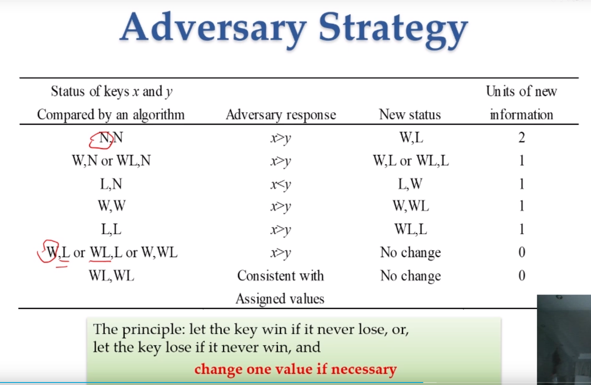
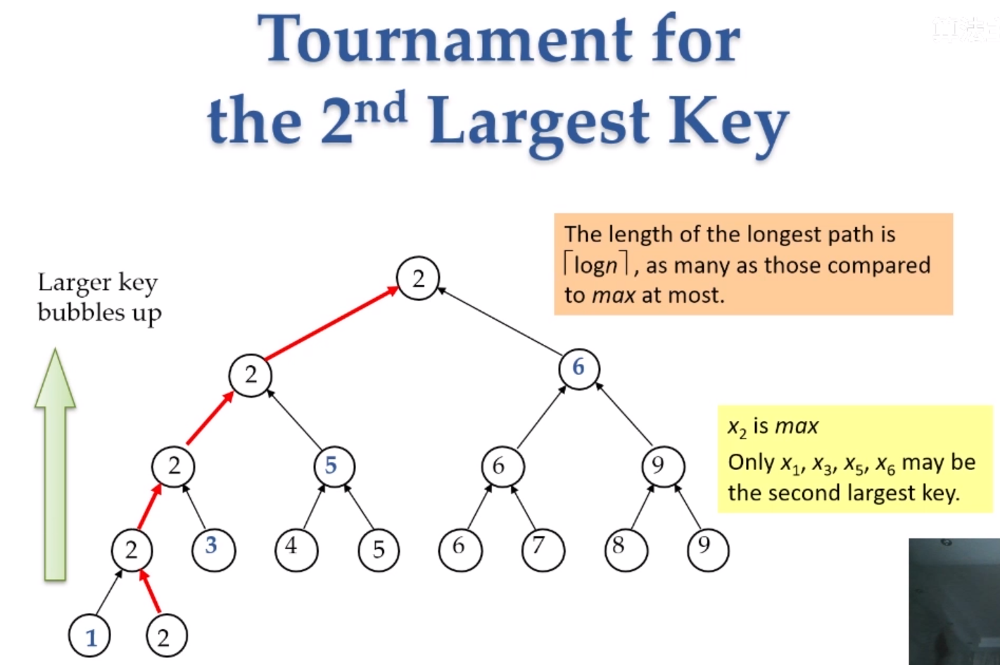

# Algorithm Notes

算法课笔记

## Adversary Argument (L7 - Selection (第一节课))

+ 抽象和数学: 对于所有算法成立.
+ 对手论证: 一个对手总在捣乱(在合法输入的范围内, 尽量对算法设计者不利的情况(比较或者其他操作更多次)), 算法设计者可以使用各种方法.

### The Selection Problem

找第$k$大的元素. Selection 和 Search 还是有点区别.

+ 证明select MAX的下界:

  任何算法必须 比较 $n - 1$ 次 $\Rightarrow$ 如果一个算法比较 $n - 2$ 次那么就是错误的.

  证明思路:

  一个元素需要比$n - 1$个元素大才是最大, 任何一个算法如果用$n - 2$次, 那么就可以使没有比较的那一个比它更大, 所以此时选择出的MAX不是最大.

  

  上面其实提出了形式化的类似Adversary Argument框架.

  

#### Comparison based sorting

都可转换为决策树. 树深度下界可以由叶子节点个数下界决定.

所以上面的Selection问题可以转化为树叶子节点最多$n$个, 所以树的高度$log n$. 但是这不是一个紧的下界.

### Select MAX and MIN

算法也要先设计出好的: 这里需要同时找MAX和MIN, 搜两遍太慢了.

这里好的算法有点像 出两拨人打架.

+ 算法: 分两拨两两比较, MAX只可能在胜者里出现, MIN只可能在败者里出现.

  复杂度: $\frac{n}{2} + 2( \frac{n}{2} - 1 )$

  

+ 证明: 共性的数学性质, MAX比其他$n - 1$大, 因为上面的算法关注的是两两比较, 对手论证的证法就是把两两的所有情况讨论出来:

  定义Unit of information: 没有比较过的到输过一次或者赢过一次就是增加一个Unit.

  + 举个很明确的对手策略的例子:

    一个曾经比别人大的元素$x$ VS 一个没比过的元素$y$:

    让$x > y$更好, 因为如果$x < y$, 那么$x$就是曾经比别人大 也曾经比别人小的元素, 这样$x$就不可能是MAX也不可能是MIN了, 这带来的信息量就很多了. 对手就是想给算法设计者信息量更小一点.

    

  

  

### Find the $2^{nd}$ Largest key

暴力: $n - 1$ 找MAX, $n - 2$ 找第二大.

如果一个元素 比一个 不是最大的元素 小, 那么肯定就不是$2^{nd}$.

思路: 锦标赛排序, 只需要在 和MAX比较中 的元素中找第二大的即可:

所以$n - 1$找最大, 然后在所有和MAX比过的元素中 $logn - 1$ 找第二大.

### Lower Bound 通过Adversary分析:

比如$x>y$, 那么一次比较$x$获得一定的量(比如获得$y$的全部量), 那么考虑$x$获得MAX应得的量要多久. 这个速度就来了.

partition其实就是找到 比它小的有$k$个

