# 一些笔记


[TOC]

## 论文笔记和代码复现

## A Neural Probabilistic Language Model

~~钉钉时代前来考古(滑稽)~~, 年代久远但意义重大, 第一次用神经网络来解决语言模型.

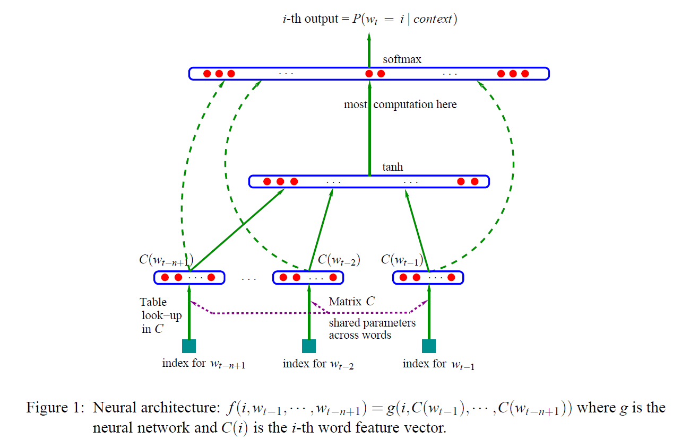

Neural Probabilistic Language Model, NNLM(Neural Network Language Model) 用多层感知机(不止输入层输出层, 中间还有隐含层, 最经典的两层感知机来解决异或问题). 如上图模型第一层是映射层, 将n个单词映射为对应word embeddings的拼接, 即多层感知机的输入层; 接下来隐含层, 激活函数用tanh(具体形式见Reading部分); 第三层是输出层, 语言模型根据前n个单词预测下一个单词, 是一个softmax多分类器.

### Reading:

language modeling and other learning problems 的难点就在 维数太高, 当想要model许多离散随机变量之间的联合分布时尤其明显; 当model连续的变量, 我们用高斯混合模型或者神经网络会带来更好的泛化性能, 因为我们有期望的一些局部连续性质. 当model离散的变量, 这些离散变量的变化对模型会带来很大影响. 而且距离会很大(比如在汉明距离中). 下面运用了链式法则和马尔可夫假设(???)


条件概率可推下一个单词, 注意其中$w_i^j = (w_i, w_{i + 1}, \cdots, w_{j - 1}, w_j)$.

利用word order可以更接近统计上的事实, `n-gram` model:


blabla相关研究, **(n-gram 再看)**, 但这些与本文的方法是相关的, 以下内容大多用矩阵表达:


**维数太高问题, 用Distributed Representations:**


1. 每一个单词对应一个词向量$\in \mathbb{R}^m$.
2. 用word sequence中的词向量表达联合概率函数.
3. 同步地 learn 词向量和概率函数的参数.

词向量的每一个维度就是一个feature, 这些feature的数量远远比vocabulary小. 概率函数表示为给定前一个单词后 的**下一个单词的条件概率的乘积**(The probability function is expressed as a product of conditional probabilities of the next word given the previous ones). 训练过程可以是maximize the log-likelihood of the training data等.

看个例子: 如果两个词在语义和语法中是相似的: dog和cat, 可以有transfer probability mass:

from: `The cat is walking in the bedroom` to `A dog was running in a room`.

小总结一下: "相似"词具有相似的特征向量, 并且概率函数是这些特征值的平滑函数; 因此特征的微小变化将导致概率函数的微小变化, 所以模型具有泛化的特点, 所以在训练数据中存在一个句子, 增加了该句子的概率和该句子在整个空间中"邻居"的组合数量(由特征向量序列表示)的概率.

**利用之前的方法:**

联合密度分布被分解成条件概率密度的乘积:


$g(\cdot)$是用从左到右的神经网络结构来表达.

讲了一些之前的方法, 没看太懂.


#### A Neural Model

重点来了/xyx

+ train set: 一个词的序列: $w_1, \dots w_T$, $w_t \in T$是vocabulary中的一个词.
+ objective: $f\left(w_{t}, \cdots, w_{t-n+1}\right)=\hat{P}\left(w_{t} | w_{1}^{t-1}\right)$, 其中$w_i^j = (w_i, w_{i + 1}, \cdots, w_{j - 1}, w_j)$. 从这个意义上说, 它给出了high out-of-sample likelihood.
+ `perplexity`: $\frac{1}{\hat{P}\left(w_{t} | w_{1}^{t-1}\right)}$, the average negative log-likelihood的指数.
+ 模型的constraint:
  + $w_1^{t - 1}$的选择
  + $\sum_{i \in V} f (i, w_t, \cdots, w_{t - n + 1}) = 1$.
  + $f > 0$.
+ 通过这些条件概率的乘积, 得到单词序列的联合概率模型.

学习目标概率函数 通过两个步骤:

1. $C \in \mathbb{R}^{|V| \times m}$ 是词向量矩阵. $m$是词向量的维度.
2. $g$ 将输入序列 对应的词向量$(C(w_{t - n + 1}, \cdots , C(w_{t - 1}))$ 映射成 一个条件概率: $f (i, w_t, \cdots, w_{t - n + 1}) = g(i, (C(w_{t - n + 1}, \cdots , C(w_{t - 1})))$.

$f$ 是两个映射$C, \ g$的合成, $C$被context里面的所有word共享.

$C$的参数就是词向量自己(每个维度的值), 函数$g$可以由前馈或递归神经网络实现(也可以由另一个参数化函数实现), 参数为$w$. 总体参数集为$\theta = (C; \ w)$


free parameters的数量只与词汇量$V$成线性关系. 它也只与$n$阶成线性比例: 如果引入更多的共享结构, 比如使用延时神经网络或递归神经网络(或两者的组合), 比例因子可以减少到次线性. (???)


**network structure:**

+ two hidden layers:

  + the shared word feature layer $C$, 非线性的.
  + the ordinary hyperbolic tangent hidden layer, `tanh`.

+ softmax output layer: 让正概率和为1.
  $$
  \hat{P}\left(w_{t} | w_{t-1}, \cdots w_{t-n+1}\right)=\frac{e^{y_{w_{t}}}}{\sum_{i} e^{y_{i}}}
  $$
  $y_i$是word i的 没有规范化的log-probabilities.

+ $y_i$: (隐含层) 词向量不仅被用作tanh的输入, 还被用作softmax的输入
  $$
  y_i = b + W x + U \tanh (d + Hx)
  $$
  其中$x$输入word序列的vector:

+ $x$: (输入层)
  $$
  x = (C(w_{t - 1}, \cdots , C(w_{t - n + 1}))
  $$

+ $h$: 隐含层单元数量.

+ $m$: 词向量维度.

(上面可以从下往上看)

实际上 上面的 $Hx$还不是最终的矩阵形式, 因为$x$要变成$X$, 而且$x$的维度其实不是$(n - 1)$, 而是$(n - 1) \times m$. 因为它展成词向量的拼接了.

free parameters: (并不是超参数), $C$词向量矩阵也是学习得到的.
$$
b, \ d, \ U (\in \mathbb{R}^{|V| \times h}), \ H (\in \mathbb{R}^{h \times (n - 1)}), \ C \in \mathbb{R}^{|V| \times m}
$$
超参数大概是: $h, \ n - 1, \ m$. ($n - 1$可以变成$n - 2, n - 3$之类)

疑问: dominating factor(???), When no direct connections from word features to outputs are desired, the matrix W is set to 0.(???)

**SGD:**


### Coding

```python
import numpy as np
import torch
import torch.nn as nn
import torch.optim as optim
from torch.autograd import Variable
import tqdm

dtype = torch.FloatTensor

sentences = [ "我 爱 她", "她 不爱 我", "我 依然爱 着她"]

word_list = " ".join(sentences).split()
word_list = list(set(word_list))

# word_dict: 每个词对应一个ID. <word: ID>
word_dict = {w: i for i, w in enumerate(word_list)}
print(word_dict)
# number_dict: word_dict的逆映射. <ID: word>
number_dict = {i: w for i, w in enumerate(word_list)}
n_class = len(word_dict) # number of Vocabulary

# NNLM Parameter
n_step = 2 # n-1 in paper 是输入的x的维度, 也是H的一个维度.
n_hidden = 4 # h in paper
m = 3 # m in paper 词向量维度(特征个数).

def make_batch(sentences):
    input_batch = []
    target_batch = []

    for sen in sentences:
        word = sen.split()
        # input: 最后一个词之前的所有, target: 最后一个词.
        input = [word_dict[n] for n in word[:-1]]
        target = word_dict[word[-1]]

        input_batch.append(input)
        target_batch.append(target)

    return input_batch, target_batch

# Model
class NNLM(nn.Module):
    def __init__(self):
        super(NNLM, self).__init__()
        self.C = nn.Embedding(n_class, m) # 维度是n_class * m, 以下维度同理.
        self.H = nn.Parameter(torch.randn(n_step * m, n_hidden).type(dtype)) # n_step * m 是x的维度之一.
        self.W = nn.Parameter(torch.randn(n_step * m, n_class).type(dtype))
        self.d = nn.Parameter(torch.randn(n_hidden).type(dtype))
        self.U = nn.Parameter(torch.randn(n_hidden, n_class).type(dtype))
        self.b = nn.Parameter(torch.randn(n_class).type(dtype))

    def forward(self, X):
        # torch.mm(a, b)是矩阵a和b矩阵相乘
        # n_step就是 n - 1.

        # X: [batch_size, n - 1]
        # batch_size 就决定了有多少个x, X矩阵由x构成.

        # 下面是把word的ID 转化成 对应的词向量.
        # 下面就是一个输入数据x是n - 1维度的(包含n-1个词), 被转化成m维度的词向量. 构成一个矩阵是[batch_size, n - 1, m]的.
        # 注意这里Embedding层的用法! 如何从  [batch_size, n - 1] -> [batch_size, n - 1, m].
        X = self.C(X) # [batch_size, n - 1, m]

        # 很牛逼, 这一步, view一下就是一个输入数据中 拼接不同词的词向量
        # 比如 x_1: ((word1Vec), (word2Vec)) -> ( word1Vec, word2Vec ).
        X = X.view(-1, n_step * m) # [batch_size, (n - 1) * m]

        # torch.mm(X, self.H): [batch_size, n_hidden]
        # torch.mm(X, self.H) 相当于 paper 中 X^T H, 其中X \in R^{(n - 1) * x 训练集个数}, H \in R^{h \times (n - 1)}

        # self.d + torch.mm(X, self.H)
        # 上面两个相加 维度: [n_hidden, ] + [batch_size, n_hidden], 这样就是后面的矩阵 每行(维度[n_hidden, ])来加上前面那个, 做batch_size次)
        tanh = torch.tanh(self.d + torch.mm(X, self.H)) # [batch_size, n_hidden]

        # torch.mm(X, self.W): [batch_size, n_class]
        # torch.mm(tanh, self.U): [batch_size, n_class]
        # self.b: [n_class, ], self.b 和后面的相加的道理 同上面 self.d + ...
        output = self.b + torch.mm(X, self.W) + torch.mm(tanh, self.U) # [batch_size, n_class]
        return output

model = NNLM()

criterion = nn.CrossEntropyLoss()
optimizer = optim.Adam(model.parameters(), lr=0.001)

# input_batch: [[3, 5], [2, 0], [3, 1]]
# target_batch: [2, 3, 4]
# 如上 batchsize就是3, 这里是对所有训练集划分, 每个epoch就直接全部送进去.
input_batch, target_batch = make_batch(sentences)
# print(input_batch)
# print(target_batch)

# 注意这里, 转化成 torch.Tensor
input_batch = Variable(torch.LongTensor(input_batch))
target_batch = Variable(torch.LongTensor(target_batch))

# Training
for epoch in tqdm.trange(5000):
    optimizer.zero_grad()
    output = model(input_batch)

    # output : [batch_size, n_class], target_batch : [batch_size] (LongTensor, not one-hot)
    loss = criterion(output, target_batch)
    if (epoch + 1) % 1000 == 0:
        print('Epoch:', '%04d' % (epoch + 1), 'cost =', '{:.6f}'.format(loss))

    loss.backward()
    optimizer.step()

# Predict
predict = model(input_batch).data.max(1, keepdim=True)[1]

# Test
print([sen.split()[:2] for sen in sentences], '->', [number_dict[n.item()] for n in predict.squeeze()])
```

舒服! 虽然比较简单, 但是感觉这个网络的维度之间的关系, 各层怎么传都理解通了!


## Distributed Representations of Words and Phrases and their Compositionality

前序论文: **Efficient Estimation of Word Representations in Vector Space**, 这篇论文大幅提高计算速度.


### Reading

> 词嵌入之间的语义关系在外行人看起来就像变魔术. 深度自然语言处理的讲座常以「国王－男人＋女人≈女王」的幻灯片来做开场白(这样的发现大多是通过t-SNE等数据可视化算法, 将词嵌入后获得的一些词向量进行非线性降维), 一篇最近在 Communications of the ACM 的文章向词嵌入模型致敬, 并称之为自然语言处理实现突破的主要原因.
>
> Word2Vec模型实际上分为了两个部分，第一部分为建立模型，第二部分是通过模型获取嵌入词向量。
>
> Word2Vec的整个建模过程实际上与自编码器（auto-encoder）的思想很相似，即先基于训练数据构建一个神经网络，当这个模型训练好以后，我们并不会用这个训练好的模型处理新的任务，真正需要的是这个模型通过训练数据所学得的参数，例如隐层的权重矩阵, 我们将会看到这些权重在Word2Vec中实际上就是试图去学习的"word vectors"。最常见的就是自编码器: 通过在隐层将输入进行编码压缩，继而在输出层将数据解码恢复初始状态，训练完成后，将输出层“砍掉”，仅保留隐层。

「词嵌入（word embeddings）」和「分布式表征（distributed representations）」是两种可互换的表示方法.

因为之前的方法计算量太大, 主要体现在 隐含层和输出层之间的矩阵运算 和 输出层上的*Softmax*归一化运算上.

**Efficient Estimation of Word Representations in Vector Space:**

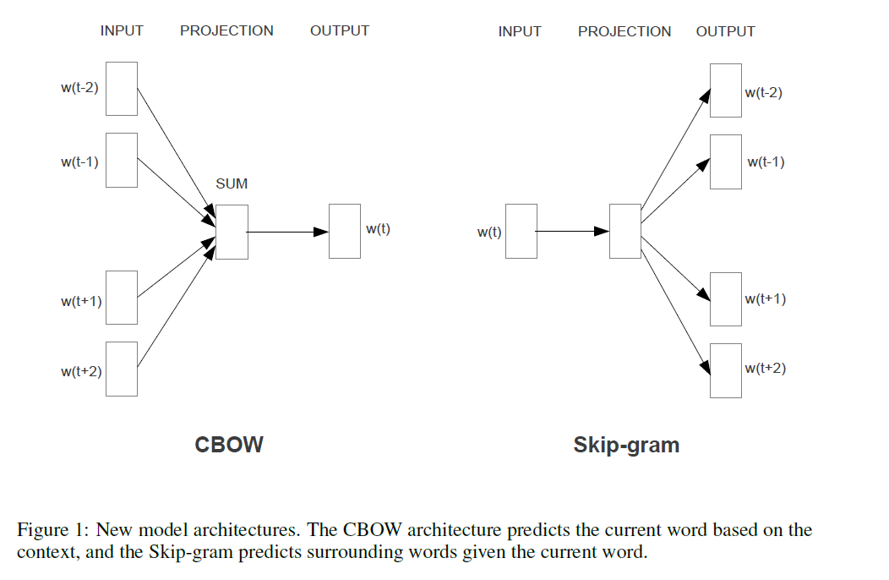

#### *Continous bag-of-words* (CBOW)

Efficient Estimation of Word Representations in Vector Space 中提出了 把目标词前面和后面的 n 个词来同时预测这个词, 用连续空间来表示词, 而且这些词的先后顺序并不重要, 和NNLM差别不大, 目标函数 接收目标词$w_t$的前后 n 个词的窗口:
$$
J_{\theta}=\frac{1}{T} \sum_{t=1}^{T} \log p\left(w_{t} | w_{t-n}, \cdots, w_{t-1}, w_{t+1}, \cdots, w_{t+n}\right)
$$

#### Skip-gram

恰恰相反, 用中心词去预测周围的词.

Training objective: finding word representations that are useful for predicting the surrounding words in a sentence:
$$
\frac{1}{T}\sum_{t = 1}^T \sum_{-c \leq j \leq c, \ j \neq 0} \log p(w_{t + j} \ | \ w_t)
$$
其中$w_1, \cdots , w_T$是training words的序列, $c$是training context的大小(可以是中心词$w_t$的函数):


可以定义$p\left(w_{t + j} | w_{t}\right)$, 这是由softmax转化过来的, 中心词为 $w_I$, 周围的词为 $w_O$:
$$
p\left(w_{O} | w_{I}\right)=\frac{\exp \left(v_{w_{O}}^{\prime \ \top} v_{w_{I}}\right)}{\sum_{w=1}^{W} \exp \left(v_{w}^{\prime \top} v_{w_{I}}\right)}
$$


##### Hierarchical Softmax

这是加速计算的一种技术: A computationally efficient approximation of the full softmax is the hierarchical softmax. the hierarchical softmax 在计算上有效地近似于 the full softmax. 其主要优点是, 不需要对神经网络中的$W$输出节点进行评估来获得概率分布, 只需要对$log_2(W)$节点进行评估即可.

The hierarchical softmax 使用输出层的二叉树表示, 以$W$作为叶节点. 并且对于每个节点显式地表示其子节点的相对概率. 下面给出定义:

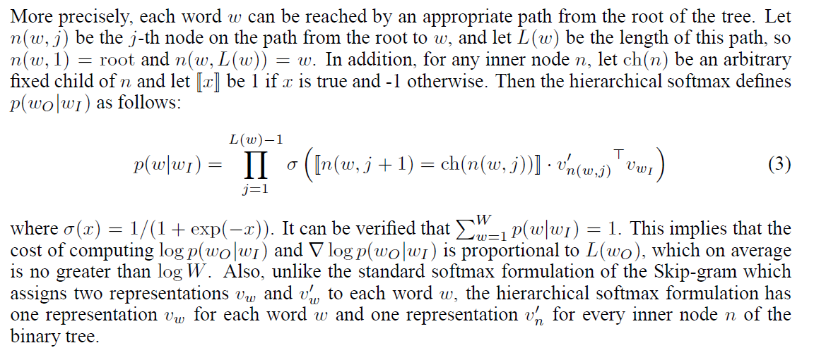

##### Negative Sampling

另一种替代hierarchical softmax的方法是噪声对比估计(NCE, Noise Contrastive Estimation), NCE假设一个好的模型应该能够通过逻辑回归的方法来区分数据和噪声. 虽然可以证明NCE近似地最大化了softmax的log概率, 但Skipgram模型只关心学习高质量的向量表示, 因此只要向量表示保持其质量, 我们就可以自由地简化NCE: 

Negative Sampling(NEG) 目标函数定义:


用于替换 Skip-gram 中$\log P(w_O|w_I)$, 

来理解一下:

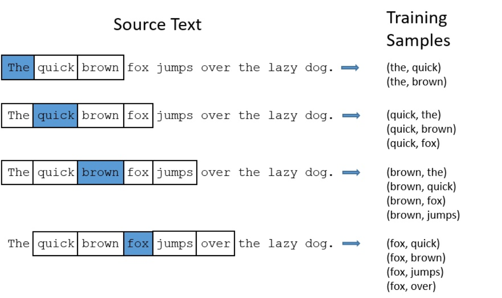

假设使用窗口大小为2的:

对于"the"这种常用高频单词, 会存在下面两个问题：

1. 当我们得到成对的单词训练样本时，("fox", "the") 这样的训练样本并不会给我们提供关于"fox"更多的语义信息，因为"the"在每个单词的上下文中几乎都会出现。
2. 由于在文本中"the"这样的常用词出现概率很大，因此我们将会有大量的（the ...）这样的训练样本，而这些样本数量远远超过了我们学习the这个词向量所需的训练样本数。

Word2Vec通过"抽样"模式来解决这种高频词问题。它的基本思想如下：对于我们在训练原始文本中遇到的每一个单词，它们都有一定概率被我们从文本中删掉，而这个被删除的概率与单词的频率有关。如果我们设置窗口大小$span = 10$, 即$skip\_window = 5$, 并且从我们的文本中删除所有的"the"，那么会有下面的结果:

1. 由于我们删除了文本中所有的the，那么在我们的训练样本中，the这个词永远也不会出现在我们的上下文窗口中。
2. 当the作为input word时，我们的训练样本数至少会减少10个。

抽样率: 计算在词汇表中保留某个词概率.

负采样不同于原本每个训练样本更新所有的权重，负采样每次让一个训练样本仅仅更新一小部分的权重，这样就会降低梯度下降过程中的计算量。

### Coding

这里没有实现Negative Sampling或者Hierarchical Softmax.

```python
import numpy as np
import torch
import torch.nn as nn
import torch.optim as optim
from torch.autograd import Variable
import matplotlib.pyplot as plt

import tqdm

dtype = torch.FloatTensor

# 3 Words Sentence
sentences = [ "i like dog", "i like cat", "i like animal",
              "dog cat animal", "apple cat dog like", "dog fish milk like",
              "dog cat eyes like", "i like apple", "apple i hate",
              "apple i movie book music like", "cat dog hate", "cat dog like"]

word_sequence = " ".join(sentences).split()
word_list = " ".join(sentences).split()
word_list = list(set(word_list))
word_dict = {w: i for i, w in enumerate(word_list)}

print(word_dict)

# 构建词到标号的字典.
# Word2Vec Parameter
batch_size = 20
embedding_size = 2  # To show 2 dim embedding graph, 也就是词向量是2维的.
voc_size = len(word_list)

def random_batch(data, size):
    random_inputs = []
    random_labels = []
    random_index = np.random.choice(range(len(data)), size, replace=False)

    for i in random_index:
        random_inputs.append(np.eye(voc_size)[data[i][0]])  # target
        random_labels.append(data[i][1])  # context word

    return random_inputs, random_labels

# Make skip gram of one size window
skip_grams = []
for i in range(1, len(word_sequence) - 1):
    target = word_dict[word_sequence[i]]
    # context: target 两边的词.
    context = [word_dict[word_sequence[i - 1]], word_dict[word_sequence[i + 1]]]

    # 可以看笔记里的图, 这里构造Training Samples.
    for w in context:
        skip_grams.append([target, w])

# Model
class Word2Vec(nn.Module):
    def __init__(self):
        super(Word2Vec, self).__init__()

        # W and WT is not Traspose relationship
        self.W = nn.Parameter(-2 * torch.rand(voc_size, embedding_size) + 1).type(dtype) # voc_size > embedding_size Weight
        self.WT = nn.Parameter(-2 * torch.rand(embedding_size, voc_size) + 1).type(dtype) # embedding_size > voc_size Weight

    def forward(self, X):
        # X : [batch_size, voc_size]
        hidden_layer = torch.matmul(X, self.W) # hidden_layer : [batch_size, embedding_size]
        output_layer = torch.matmul(hidden_layer, self.WT) # output_layer : [batch_size, voc_size]
        return output_layer

model = Word2Vec()

criterion = nn.CrossEntropyLoss()
optimizer = optim.Adam(model.parameters(), lr=0.001)

# Training
for epoch in tqdm.trange(5000):

    input_batch, target_batch = random_batch(skip_grams, batch_size)

    input_batch = Variable(torch.Tensor(input_batch))
    target_batch = Variable(torch.LongTensor(target_batch))

    optimizer.zero_grad()
    output = model(input_batch)

    # output : [batch_size, voc_size], target_batch : [batch_size] (LongTensor, not one-hot)
    loss = criterion(output, target_batch)
    if (epoch + 1)%1000 == 0:
        print('Epoch:', '%04d' % (epoch + 1), 'cost =', '{:.6f}'.format(loss))

    loss.backward()
    optimizer.step()

for i, label in enumerate(word_list):
    # 获取训练完的参数. 就是embedding后的结果.
    W, WT = model.parameters()
    x,y = float(W[i][0]), float(W[i][1])
    plt.scatter(x, y)
    plt.annotate(label, xy=(x, y), xytext=(5, 2), textcoords='offset points', ha='right', va='bottom')
plt.show()
```


## Convolutional Neural Networks for Sentence Classification

使用卷积神经网络进行句子级分类任务.

### Reading

#### Model

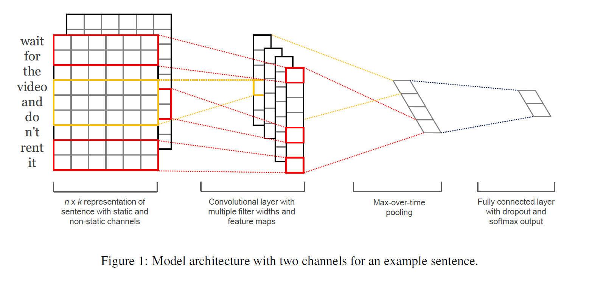

+ $x_i \in \mathbb{R}^k$ 句子中第$i$个词的 $k$维的词向量. 一个从1到$n$的表示定义为:
  $$
  \mathbf{x}_{1: n}=\mathbf{x}_{1} \oplus \mathbf{x}_{2} \oplus \ldots \oplus \mathbf{x}_{n}
  $$
  $\oplus$ 是concatenation operator.

  

+ 卷积运算涉及到滤波器 filter $w \in \mathbb{R}^{hk}$, 被卷积运算于 一个 $h$ 个words 的窗口来产生一个新特征. 例如新特征$c_i$:
  $$
  c_{i}=f\left(\mathbf{w} \cdot \mathbf{x}_{i: i+h-1}+b\right)
  $$
  其中$b$是一个bias, $f$是一个非线性函数. 注意这里卷积运算是作用于所有可能的window的, 比如$\left\{\mathbf{x}_{1: h}, \mathbf{x}_{2: h+1}, \dots, \mathbf{x}_{n-h+1: n}\right\}$, 

  

+ 经过卷积运算之后生成了:
  $$
  \mathbf{c}=\left[c_{1}, c_{2}, \ldots, c_{n-h+1}\right]
  $$
  
+ max-over-time pooling operation, $\hat{c} = \max \mathbf{c}$, 这样就完成了从卷积运算中提取一个特征的过程.

综上, 这些特征形成倒数第二层, 并传递给一个全连接的softmax层, 其输出是标签上的概率分布.

##### Regularization

在倒数第二层使用dropout，并对权重向量的$l_2$-范数进行约束。Dropoutp revents co-adaptation of hidden units by randomlyd ropping out --- i.e., setting to zero --- a proportion $p$ of the hidden units during fowardbackpropagation. 具体形式为:
$$
y=\mathbf{w} \cdot(\mathbf{z} \circ \mathbf{r})+b
$$
其中 $\circ$ 是element-wise multiplication operator, $r \in \mathbb{R}^m$ 是 ‘masking’ vector of Bernoulli random variables. Gradients are backpropagated only through theu nmasked units. 

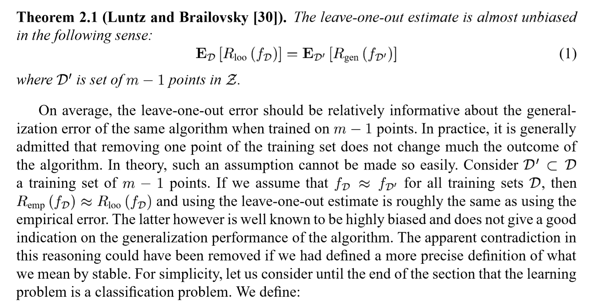


## Finding Structure in Time

### Reading

直接看*RNN* tutorial.

句子序列的学习任务时, 首先在输入输出层面, 无法做到处理不同长度的句子. 其次一般神经网络无法学习句子中不同位置的词带来的信息. 比如我去中国与我离开中国, 输出层是某个词作为目的地与出发地的概率, 对于上面两句话同样是"中国"这个词的输入, 一般神经网络只能输出同样的结果, 但这显然第一句话中"中国"作为目的地, 第二句话中作为出发地.

RNN的隐含层是有记忆的, 就像我们人在阅读的时候大脑中已经有之前学习过的东西了, 在学习的基础上继续学习, RNN在看见下一个词的时候, 还会把之前输入的作为当前输入的一部分, 共同作用. 第一层的隐含层内激活值会传到下一次输入, 在每一步都会, 直到最后一步. 可以使用零向量来作为第一层的激活值. RNN在处理当前词时, 还考虑之前它所见过的词, 这就是为什么它能学习位置信息的原因.

这里隐含层的参数是共享的. 接下来将详细推导参数传递的过程:
$$
\text{The hidden layer parameter initialization: }a^{(0)}=\overrightarrow{0} \\ \text{First propagation: }a^{(1)}=g_{1}\left(W_{a a} a^{(0)}+W_{a x} x^{(1)}+b_{a}\right) \\ \text{First layer output: }\hat{y}^{(1)}=g\left(W_{y_{0}} a^{(1)}+b_{y}\right)
$$
很容易可以推广到第i层:
$$
\begin{array}{l}{a^{(t)}=g\left(W_{a a} a^{(t-1)}+W_{a x} x^{(t)}+b_{a}\right)} \\ {\hat{y}^{( t )}=g\left(W_{y a} a^{(t)}+b_y\right)}\end{array}
$$
这里是指对第一个词的第一次forward propagation. 其中g是激活函数, 一般使用tanh. $x^{<i>}$ 是第i次输入, $\hat{y}^{<i>}$ 是第i次输出. $a$是隐含层参数矩阵, $W$ 是网络的参数矩阵, $b_{y}$是当前偏置常量.

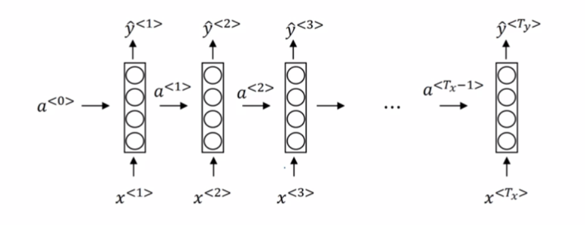

结合RNN的结构图我们可以更清楚的理解各参数的传导过程. 我在上面故意把$W$矩阵分开来写, 可以更好的分层来看每一词进入网络后的传播过程. 论文里给出的一般都是通过数学处理之后合并的矩阵形式:
$$
W \left[\begin{array}{c}{a^{(t-1)}} \\ {x^{(t)}}\end{array}\right] = \left[W_{a a} W_{a x}\right]\left[\begin{array}{c}{a^{(t-1)}} \\ {x^{(t)}}\end{array}\right] = W_{a a} a^{(t-1)}+W_{a x} x^{(t)}
$$
接下来自然是backpropagation through time, 非常有趣的名字, 先来看loss function, 是交叉熵, 它代表了在某个时间步上对一个词预测的损失:

$$
\mathcal{L}^{(t)}\left(\hat{y}^{(t)}, y^{(t)}\right)=-y^{(t)} \log \hat{y}^{( t)}-\left(1-y^{( t)}\right) \log \left(1-\hat{y}^{(t)}(t)\right)
$$

$$
\mathcal{L}(\hat{y}, y)=\sum_{t=0}^{T_y} \mathcal{L}^{( t)}\left(\hat{y}^{( t)}, y^{( t)}\right)
$$

在前向传播的时候计算loss function, 在其相反方向推导各个参数, 在每一个时间步的推导中, 明确我们需要计算的是相对于参数的误差梯度, 然后通过SGD或者其他计算更新参数. 注意对每一个时间步需要求和:

$$
\frac{\partial \mathcal{L}}{\partial W}=\sum_{t} \frac{\partial \mathcal{L}_{t}}{\partial W}
$$

很自然地运用链式法则:

$$
\begin{aligned} \frac{\partial \mathcal{L}_{i}}{\partial W} &=\frac{\partial \mathcal{L}_{i}}{\partial \hat{y}_{i}} \frac{\partial \hat{y}_{i}}{\partial W} \\ &=\frac{\partial \mathcal{L}_{i}}{\partial \hat{y}_{i}} \frac{\partial \hat{y}_{i}}{\partial a_{i}} \frac{\partial a_{i}}{\partial W} \end{aligned}
$$


这里采用PyTorch对实现部分做一个详述, 其实和传统前馈神经网络的传播方式比较, 最大的不同还是在数据流经过网络内部参数的更新方式. RNN不是一次喂进所有数据(微观上), 每一隐含层的结果都会影响下一次输入, RNN 可以被看做是同一神经网络的多次复制，每个神经网络模块会把消息传递给下一个。需要注意的是, 上面所用的例子中RNN都是为了展示方便, 每个隐含层结点被拆成许多个, 其实它们都是一个并且不断循环不断计算.

RNN的结构是有限制的, 主要是对于长距离的记忆效果很差（序列开始的信息在后期保留很少）, 而且序列开头的词汇不能被很好预测, 比如这两句话: "Teddy Roosevelt was a President.", "Teddy bears are on sale". RNN很难确定Teddy是不是一个人名. 在长期信息访问当前处理单元之前，需要按顺序地通过所有之前的单元, 这意味着它很容易遭遇梯度消失问题. 这也为我接下来要读的论文埋下伏笔, 研究LSTM, GRU, 或者更强大的注意力机制, 层级注意力编码方式等. 下面就来说说什么是RNN的梯度消失.

如果有一句很长的话, 意味着在RNN循环较后的结点(较后的词)$\hat{y}^{<i>}$由于距离长, 很难受到开头词的影响, 同样在反向传播过程中, 句子后部区域的偏导数也很难影响到前面. RNN这个问题很容易可以类比到深层神经网络的梯度问题.

接下来学习的是较基础的也是比较有用的解决梯度消失的方法(其他方法有改进矩阵初始化值或者改变激活函数): Gate Recurrent Unit, 它有一个memory cell, 不妨记为$c^{(t)}$, 在简单的GRU中可以认为$c^{(t)} = a^{(t)}$, 刚刚在RNN中提到过, 这就是隐含层: 上一次见过的词或者也可以说成short-term memory, 我们可以得到如下更新迭代过程, 其中包含memory cell和gate的计算:

$$
\begin{array}{l}{\hat{c}^{( t)}=\tanh \left(W_{c}\left[\Gamma_{relevance} \times c^{( t-1)}, x^{(t)}\right]+b_{u}\right)} \\ {\Gamma_{update}=\sigma\left(W_{u}\left[c^{( t-1)}, x^{( t)}\right]+b_{u}\right)}\end{array}
$$

从gate的含义可以看出, 就是一个filter的作用, 如何体现呢:

$$
c^{\langle t\rangle}=\Gamma_{u} \times \hat{c}^{(t)}+\left(1-\Gamma_{u}\right) \times c^{\langle t-1\rangle}
$$

注意这里的gate是经过 $\sigma$ sigmoid函数处理的, 所以当我们真正需要记忆细胞, 需要保持记忆的时候, gate经过sigmoid函数之后会变得很小, 这样就保持了长期记忆的传递, 在一定程度上解决了梯度消失的问题.

接下来我学习了GRU的一个更强大, 更通用的版本: LSTM. LSTM在序列模型上有着划时代的影响. 对比RNN, 在RNN的每个神经元中, 输入经过隐含层参数(包含之前的输入信息)与激活函数获得下一层输出. 而LSTM就复杂了许多, 在每一个时间步LSTM都接受三种数据: 当前输入, "上一个"神经元的short-term memory以及long-term memory. The short-term memory is referred to as the hidden state, and the long-term memory is known as the cell state. LSTM使用gate(the Input Gate, the Forget Gate, and the Output Gate.)来控制数据到short-term memory和long-term memory, 它们可以有选择地删除无关的数据. 

如图我们来慢慢看每一个gate的结构.

首先是Input Gate, 它从当前输入和short-term memory来决定了什么数据要存储在 long-term memory. 如图所示它有两层, 第一层主要是筛选经过的数据, 怎么做呢, 将short-term memory和当前输入喂给sigmoid function. 注意这里不再有$a^{<t>}=c^{<t>}$, 总结一下参数与gate的更新过程:

$$
\text{memory cell previous value: }\tilde{c}^{<t>}=\tanh \left(W_{c}\left[a^{<t-1>}, x^{<t>}\right]+b_{c}\right.
$$

$$
\text{update gate: }\Gamma_{u}=\sigma\left(W_{u}\left[a^{<t-1>}, x^{<t>}\right]+b_{u}\right)
$$

$$
\text{forget gate: } \Gamma_{f}=\sigma\left(W_{f}\left[a^{<t-1>}, x^{<t>}\right]+b_{f}\right)
$$

$$
\text{output gate: } \left.\Gamma_{o}=\sigma\left(W_{o}\left[a^{<t-1>}, x^{<t>}\right]+\right\rangle b_{o}\right)
$$

$$
\text{memory cell update through: } c^{<t>}=\Gamma_{u} * \tilde{c}^{<t>}+\Gamma_{f} * c^{<t-1>}
$$

最后很自然地有:

$$
a^{<t>}=\Gamma_{o} * \tanh c^{<t>}
$$
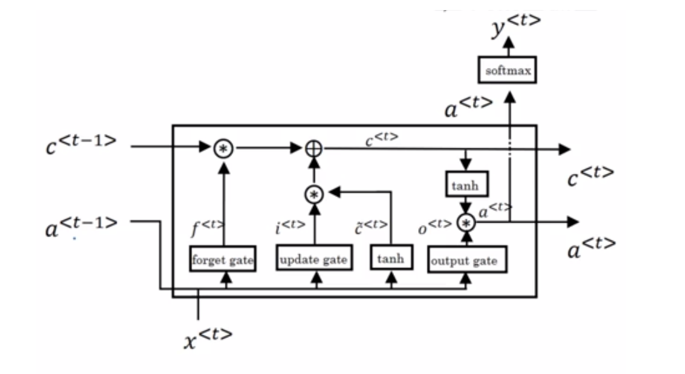

跟着图可以详细解释一下LSTM的过程: 首先通过forget gate, 来判断什么数据是无用的不相关的, 通过gate的sigmoid function抛弃, 然后根据之前的数据通过 update gate, 刷新一下cell state. 最后再经过output gate返回经过transform后的数据.

### Coding

### Model A: 1 Hidden Layer (ReLU)

- Unroll 28 time steps
  - Each step input size: 28 x 1
  - Total per unroll: 28 x 28
    - Feedforward Neural Network input size: 28 x 28
- 1 Hidden layer
- ReLU Activation Function


## Effective LSTMs for Target-Dependent Sentiment Classification

### Reading

#### TD-LSTM

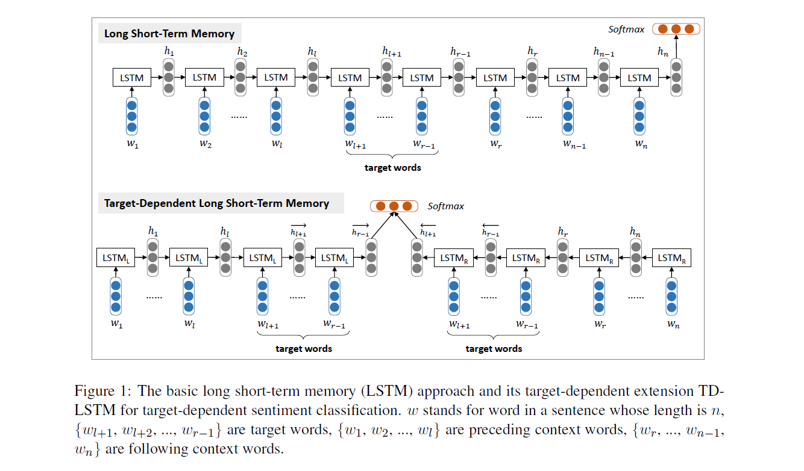

根据aspect之前和之后的上下文分别建模: $LSTM_L$, $LSTM_R$. 输入为aspect之前的上下文加上aspect. softmax 函数作为最后一层的激活函数.

没有考虑aspect和上下文的关联.

#### TC-LSTM

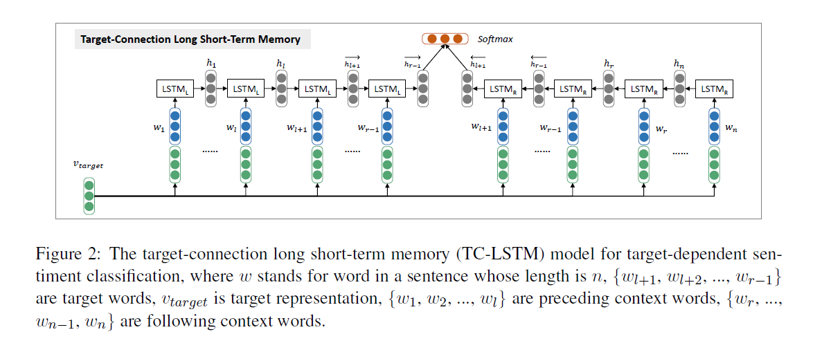

输入端将aspect和TD-LSTM中的输入向量拼接起来.


## Attention-based LSTM for Aspect-level Sentiment Classification

### Reading

#### 模型特点:

AE-LSTM 这种标准LSTM模型没有考虑特定aspect和上下文之间的关联影响, 无法区分出对特定aspect更重要的上下文信息. 

1. aspect-embedding

   输入层向量与aspect向量进行拼接作为输入, 还有在计算权重$\alpha$的时候, 将LSTM输出的隐层表示与aspect向量进行拼接, 这样可以对单词与输入方面之间的相互依赖性进行建模.

2. attention-mechanism: attention 机制作用是对句子中不同重要程度的单词给予不同的权重. 通过加权求和求出的句子表示可以提高准确度. 根据序列的变化更新最关心的部分.

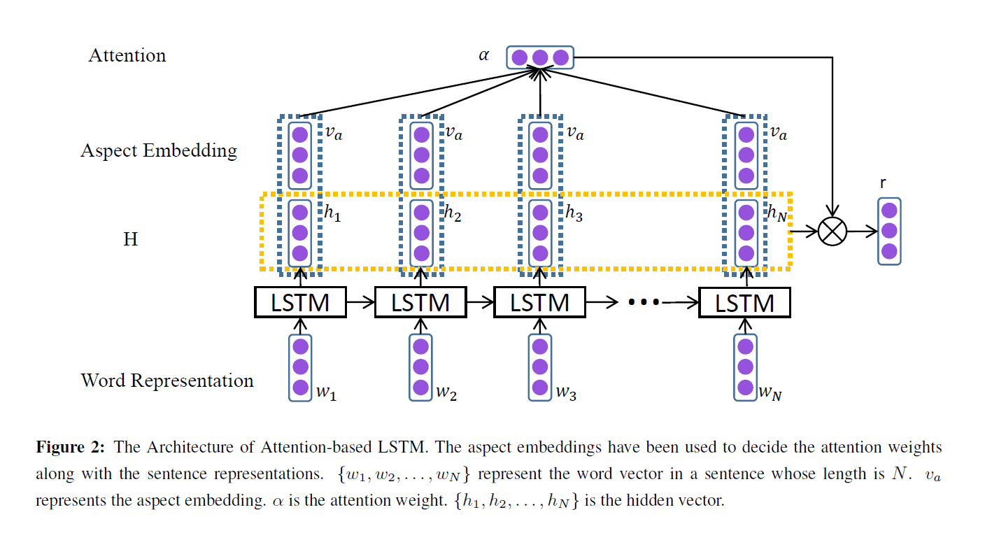

#### 网络结构:

$$
\begin{array}{l}
M=\tanh \left(\left[\begin{array}{c}
W_{h} H \\
W_{v} v_{a} \otimes e_{N}
\end{array}\right]\right) \\
\alpha=\operatorname{softmax}\left(w^{T} M\right) \\
r=H \alpha^{T}
\end{array}
$$

$M$是将LSTM输出的隐层表示与aspect向量拼接后作为输入, 得到新的隐层表示. 将该隐层表示$M$和一个上下文向量$w$过softmax, 就可以得到权重矩阵$\alpha$, 具体操作如上所示.
$$
h^{*}=\tanh \left(W_{p} r+W_{x} h_{N}\right)
$$

##### 机器学习(主要是PRML里或者说从贝叶斯角度的):


